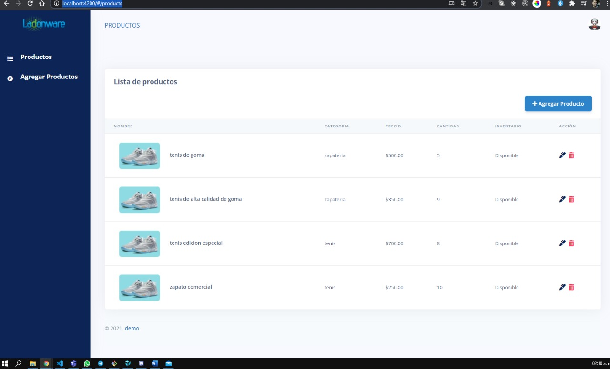
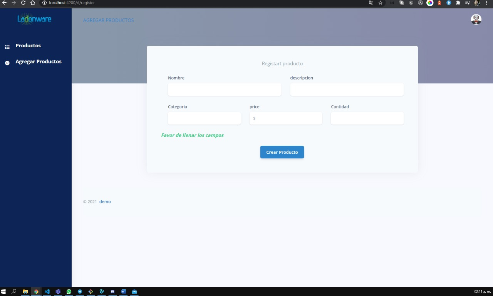

# Demo app

demo de app en angular 11

Para incializar la app tienes que bajar dependecias que se encuentran en el 
package.json y esto lo podemos lograr con el siguientes comandos.
```sh
$ npm install 
```

una vez ya descargadas las dependencias tenemos que ejecutar en consola el comando de npm 

```sh
$ npm start
```
o 
```sh
$ ng serve
```
el resultado sera la lista de los productos


## Lista:



Para realizar alguna busqueda editamos y damos enter y el resultado sera presentado en la parte de abajo 

## Formulario:



Creado por Juan Carlos Buendia

License
----

MIT


**Free Software, Hell Yeah!**
